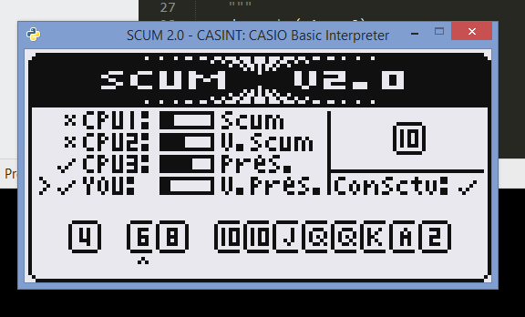

# casint
CASIO Basic Interpreter



A simple interpreter for CASIO Basic using G1M files as input. Uses SDL for graphics.

## Installing

Requirements:
* Python 3.6+
* SDL2 installation

1. Clone the repo
2. Install the requirements

```
pip install -r requirements.txt
```

3. Install SDL2

If using Windows, it's sufficient to download a runtime binary from https://www.libsdl.org/download-2.0.php

Drop the appropriate DLL in lib/32 or lib/64. Might need to create these directories.

4. Run it!

```
python run.py input/captures/SCUM2.G1M
```

## Tooling

The program `g1mtool.py` can convert between G1M and text/image files. This makes it convenient to edit and debug programs. To unpack the contents of a G1M file into a directory, run

```
python g1mtool.py unpack input/captures/SCUM2.g1m output/scum2/
```

This will dump the parsed programs into text files with the `.ucb` file extension. Pictures will be dumped to 24-bit bitmap (`.bmp`) files.

`g1mtool.py` can pack the contents of a directory back into a G1M file.

```
python g1mtool.py pack output/scum2/ input/pack/SCUM2.g1m
```

It is also possible to load the unpacked `.ucb` files directly into casint.

```
python run.py output/scum2/
```

## Comments

The program is parsed into an abstract syntax tree (AST) and nodes interpreted recursively. While this is simple to code, the program does not actually reflect the source and, as such, certain jump instructions like GOTO or ISZ/DSZ are not completely implemented.
Future work will involve constructing a control flow graph (CFG) from the AST and interpreting that instead.

## References

The excellent blog posts at https://ruslanspivak.com/lsbasi-part1/
