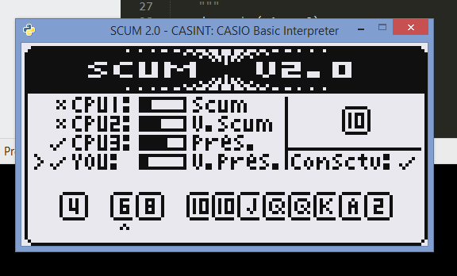

# casint
CASIO Basic Interpreter



A simple interpreter for CASIO Basic using G1M files as input. Uses SDL for graphics.

## Installing

Requirements:
* Python 3
* SDL2 installation

1. Clone the repo
2. Install the requirements 

```
pip install -r requirements.txt
```

3. Install SDL2

If using Windows, it's sufficient to download a runtime binary from https://www.libsdl.org/download-2.0.php

Drop the appropriate DLL in lib/32 or lib/64. Might need to create these directories.

4. Run it!
```
python run.py input/captures/SCUM2.G1M
```

## Comments

The program is parsed into an abstract syntax tree (AST) and nodes interpreted recursively. While this is simple to code, the program does not actually reflect the source and, as such, certain jump instructions like GOTO or ISZ/DSZ are not completely implemented.
Future work will involve constructing a control flow graph (CFG) from the AST and interpreting that instead.

## References

The excellent blog posts at https://ruslanspivak.com/lsbasi-part1/
